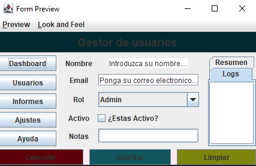
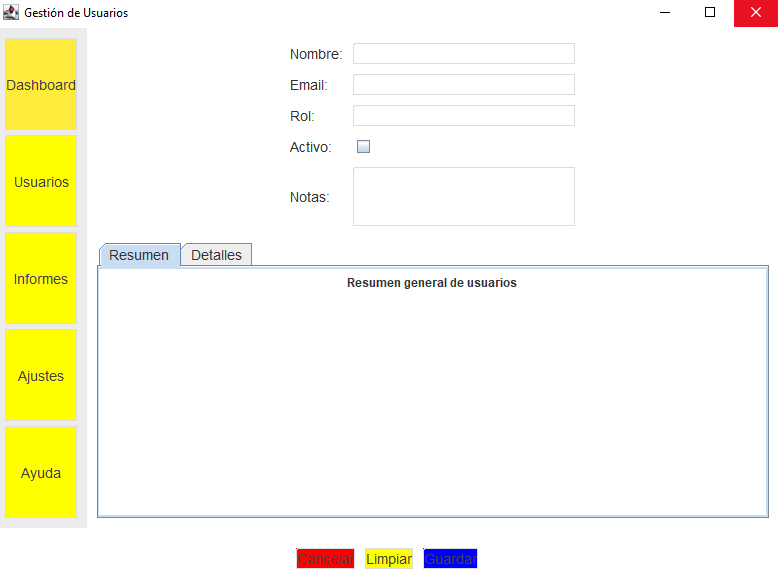
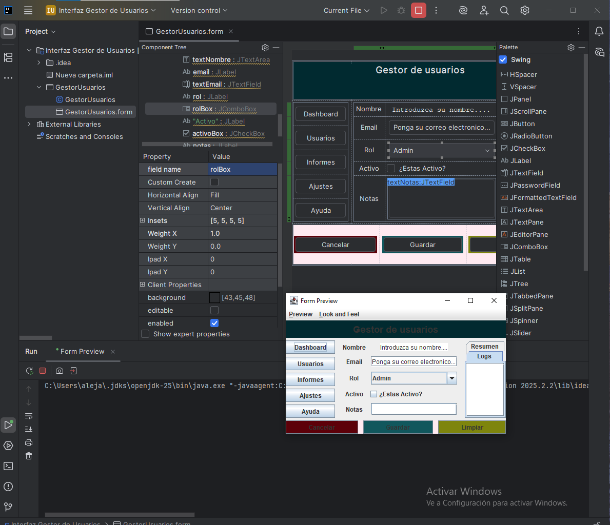

# Gestor de Usuarios - Tema 2: Paneles y Layouts

## 📋 Descripción del Proyecto

Aplicación de escritorio desarrollada en Java Swing que implementa una interfaz profesional de gestión de usuarios utilizando múltiples layouts y componentes avanzados. Este proyecto demuestra el uso correcto de `BorderLayout`, `FlowLayout`, `GridLayout` y `GridBagLayout` en una única ventana. Incluye un formulario para ingresar datos de usuarios, un panel de navegación lateral y un área de pestañas para resúmenes, junto con botones de acción en la parte inferior.

---

## 🎯 Objetivos de Aprendizaje

- Diseñar interfaces a partir de wireframes
- Elegir conscientemente el número de `JPanel` y layouts apropiados
- Dominar el uso de múltiples layouts en una sola ventana
- Aplicar buenas prácticas en distribución y comportamiento responsive

---

## 🏗️ Estructura de Contenedores

```
JFrame (BorderLayout)
 ├─ WEST: panelNav (GridLayout 5×1)
 │   ├─ JButton "Dashboard"
 │   ├─ JButton "Usuarios"
 │   ├─ JButton "Informes"
 │   ├─ JButton "Ajustes"
 │   └─ JButton "Ayuda"
 │
 ├─ CENTER: panelMain (BorderLayout)
 │   ├─ NORTH: panelForm (GridBagLayout)
 │   │   ├─ Fila 0: JLabel "Nombre:" | JTextField
 │   │   ├─ Fila 1: JLabel "Email:" | JTextField
 │   │   ├─ Fila 2: JLabel "Rol:" | JTextField
 │   │   ├─ Fila 3: JLabel "Activo:" | JCheckBox
 │   │   └─ Fila 4: JLabel "Notas:" | JTextArea
 │   │
 │   └─ CENTER: pestañas (JTabbedPane)
 │       ├─ Pestaña "Resumen" (JPanel con JLabel)
 │       └─ Pestaña "Detalles" (JPanel con JLabel)
 │
 └─ SOUTH: south (FlowLayout CENTER)
     ├─ JButton "Cancelar"
     ├─ JButton "Limpiar"
     └─ JButton "Guardar"
```

---

## 🎨 Wireframe



---

## 📐 Justificación de Layouts

### BorderLayout (Ventana Principal)
**¿Por qué?** 
- Permite dividir claramente la ventana en 3 zonas principales (West, Center, South), ideal para estructuras con navegación lateral, área central de contenido y footer con acciones.

### GridLayout (Panel de Navegación)
**¿Por qué?** 
- Los 5 botones de navegación tienen el mismo tamaño y se distribuyen uniformemente en una columna (5×1), perfecto para menús verticales.

### BorderLayout (Panel Principal Central)
**¿Por qué?** 
- Divide el área central en Norte (formulario) y Centro (pestañas), permitiendo un flujo lógico de entrada de datos seguido de visualización.

### GridBagLayout (Formulario)
**¿Por qué?** 
- Ofrece control total sobre la posición, tamaño y comportamiento de redimensionado de cada campo del formulario. Permite que componentes como el JTextArea de notas ocupen espacio horizontal.

### FlowLayout (Botonera Inferior)
**¿Por qué?** 
- Permite alinear los botones de acción de forma centrada con espaciado uniforme, facilitando una distribución equilibrada.

---

## ⚙️ Propiedades Clave Utilizadas

| Componente | Propiedad | Valor | Justificación |
|------------|-----------|-------|---------------|
| **panelNav** | Layout | GridLayout(5,1,0,5) | 5 botones uniformes en vertical con separación |
| **panelNav** | Background | Color(0xECECEC) | Fondo gris claro para contraste |
| **Botones nav** | Background | Color.yellow (primero: accentYellow) | Destaca el botón activo |
| **Botones nav** | Border | LineBorder(grisMedio,1,true) | Bordes redondeados para estilo moderno |
| **panelForm** | Layout | GridBagLayout | Control preciso de posicionamiento |
| **Campos formulario** | weightx | (implícito 1.0) | Se estiran horizontalmente |
| **gbc** | fill | HORIZONTAL | Ocupan todo el ancho disponible |
| **gbc** | insets | (5,5,5,5) | Márgenes uniformes |
| **Etiquetas** | anchor | WEST | Alineadas a la izquierda |
| **JTextArea (Notas)** | rows/columns | 3,20 | Tamaño inicial fijo para multilínea |
| **pestañas** | (JTabbedPane) | - | Navegación entre vistas de resumen |
| **south** | alignment | CENTER | Botones centrados para balance |
| **Botones acción** | Background | red/yellow/blue | Colores distintivos por función |
| **Todos los componentes** | Font | SansSerif, PLAIN, 14 | Consistencia tipográfica |

---

## 📸 Capturas de Pantalla

### Vista General


### Vista Redimensionada

*Observar cómo el formulario y las pestañas crecen proporcionalmente*

---

## 🔄 Comportamiento al Redimensionar

### Componentes que Crecen
- ✅ **Formulario Central** (HORIZONTAL fill): Se expande horizontalmente
- ✅ **Pestañas Centrales**: Crece para aprovechar el espacio disponible
- ✅ **JTextArea de Notas**: Mantiene tamaño pero se adapta al contenedor

### Componentes Estables
- 🔒 **Panel de Navegación (WEST)**: Mantiene su ancho preferido
- 🔒 **Botonera (SOUTH)**: Mantiene su altura, botones centrados

---

## 🛠️ Tecnologías Utilizadas

- **Java SE** (JDK 11+)
- **Swing** (javax.swing)

---

## 📦 Estructura de Archivos

```
Ejercicio_Tema_2_Paneles_Layouts_como_profesionales/
├── src/
│   └── GestorUsuarios.java        # Lógica de la ventana principal
├── resources/
│   ├── wireframe_login.png        # Wireframe inicial
│   └── captura-*.png              # Capturas de pantalla
└── README.md
```

---

## 🚀 Cómo Ejecutar

1. Compilar y ejecutar el código Java directamente:
```bash
javac GestorUsuarios.java
java GestorUsuarios
```

O, si usas un IDE como IntelliJ IDEA o Eclipse:

2. Abrir el archivo `GestorUsuarios.java`

3. Ejecutar la clase `GestorUsuarios`

El `main` inicia la aplicación en el EDT (Event Dispatch Thread) para threading seguro.

---

## 📄 Licencia

Este proyecto fue desarrollado como parte del material educativo del curso de Desarrollo de Interfaces.

---

